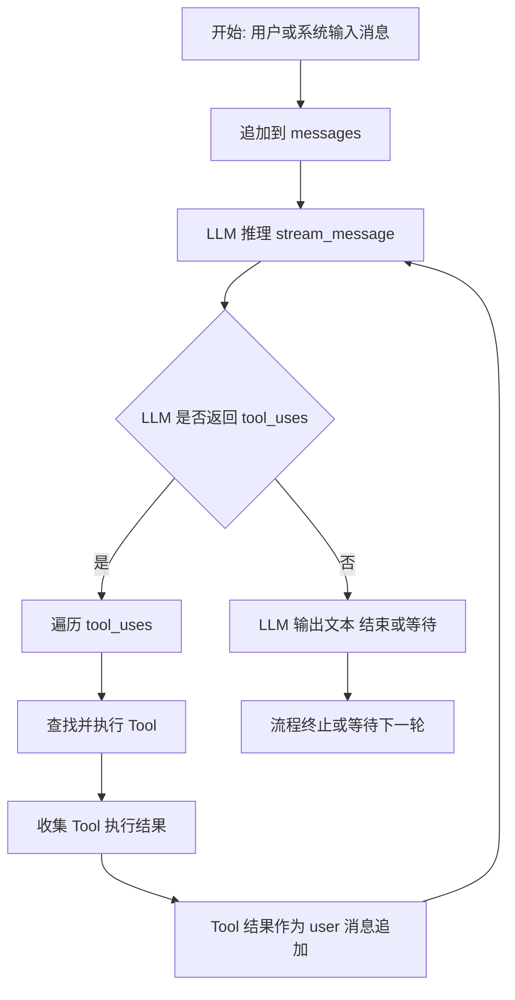

# query.py 逐行解释

本文件为 OpenHarness 的核心查询循环实现，负责与 LLM 交互、工具调用、权限校验、消息流处理等。

---

## 1-20 行
```python
"""Core tool-aware query loop."""
from __future__ import annotations
import asyncio
from dataclasses import dataclass
from pathlib import Path
from typing import AsyncIterator, Awaitable, Callable

from openharness.api.client import (
    ApiMessageCompleteEvent,
    ApiMessageRequest,
    ApiRetryEvent,
    ApiTextDeltaEvent,
    SupportsStreamingMessages,
)
from openharness.api.usage import UsageSnapshot
from openharness.engine.messages import ConversationMessage, ToolResultBlock
from openharness.engine.stream_events import (
    AssistantTextDelta,
    AssistantTurnComplete,
    ErrorEvent,
    StatusEvent,
    StreamEvent,
    ToolExecutionCompleted,
    ToolExecutionStarted,
)
from openharness.hooks import HookEvent, HookExecutor
from openharness.permissions.checker import PermissionChecker
from openharness.tools.base import ToolExecutionContext, ToolRegistry
```
**解释：**
- 引入了异步、数据类、路径、类型注解等基础模块。
- 引入了 openharness 的 API 客户端、消息、事件、权限、工具等核心模块。

---

## 21-40 行
```python
PermissionPrompt = Callable[[str, str], Awaitable[bool]]
AskUserPrompt = Callable[[str], Awaitable[str]]

class MaxTurnsExceeded(RuntimeError):
    """Raised when the agent exceeds the configured max_turns for one user prompt."""
    def __init__(self, max_turns: int) -> None:
        super().__init__(f"Exceeded maximum turn limit ({max_turns})")
        self.max_turns = max_turns
```
**解释：**
- `PermissionPrompt`、`AskUserPrompt`：异步回调类型，用于权限确认和用户交互。
- `MaxTurnsExceeded`：自定义异常，表示对话轮数超限。

---

## 41-60 行
```python
@dataclass
class QueryContext:
    """Context shared across a query run."""
    api_client: SupportsStreamingMessages
    tool_registry: ToolRegistry
    permission_checker: PermissionChecker
    cwd: Path
    model: str
    system_prompt: str
    max_tokens: int
    permission_prompt: PermissionPrompt | None = None
    ask_user_prompt: AskUserPrompt | None = None
    max_turns: int | None = 200
    hook_executor: HookExecutor | None = None
    tool_metadata: dict[str, object] | None = None
```
**解释：**
- `QueryContext`：查询上下文，贯穿一次 query 的所有状态。
- 包含 API 客户端、工具注册表、权限检查器、当前目录、模型名、系统提示、最大 token、权限/用户回调、最大轮数、hook 执行器、工具元数据等。

---

## 61-120 行
```python
async def run_query(
    context: QueryContext,
    messages: list[ConversationMessage],
) -> AsyncIterator[tuple[StreamEvent, UsageSnapshot | None]]:
    """Run the conversation loop until the model stops requesting tools.

    Auto-compaction is checked at the start of each turn.  When the
    estimated token count exceeds the model's auto-compact threshold,
    the engine first tries a cheap microcompact (clearing old tool result
    content) and, if that is not enough, performs a full LLM-based
    summarization of older messages.
    """
    from openharness.services.compact import (
        AutoCompactState,
        auto_compact_if_needed,
    )

    compact_state = AutoCompactState()
    turn_count = 0
    while context.max_turns is None or turn_count < context.max_turns:
        turn_count += 1
        # --- auto-compact check before calling the model ---------------
        messages, was_compacted = await auto_compact_if_needed(
            messages,
            api_client=context.api_client,
            model=context.model,
            system_prompt=context.system_prompt,
            state=compact_state,
        )
        # ---------------------------------------------------------------

        final_message: ConversationMessage | None = None
        usage = UsageSnapshot()

        try:
            async for event in context.api_client.stream_message(
                ApiMessageRequest(
                    model=context.model,
                    messages=messages,
                    system_prompt=context.system_prompt,
                    max_tokens=context.max_tokens,
                    tools=context.tool_registry.to_api_schema(),
                )
            ):
                if isinstance(event, ApiTextDeltaEvent):
                    yield AssistantTextDelta(text=event.text), None
                    continue
                if isinstance(event, ApiRetryEvent):
                    yield StatusEvent(
                        message=(
                            f"Request failed; retrying in {event.delay_seconds:.1f}s "
                            f"(attempt {event.attempt + 1} of {event.max_attempts}): {event.message}"
                        )
                    ), None
                    continue
                if isinstance(event, ApiMessageCompleteEvent):
                    final_message = event.message
                    usage = event.usage
        except Exception as exc:
            error_msg = str(exc)
            if "connect" in error_msg.lower() or "timeout" in error_msg.lower() or "network" in error_msg.lower():
                yield ErrorEvent(message=f"Network error: {error_msg}. Check your internet connection and try again."), None
            else:
                yield ErrorEvent(message=f"API error: {error_msg}"), None
            return

        if final_message is None:
            raise RuntimeError("Model stream finished without a final message")

        messages.append(final_message)
        yield AssistantTurnComplete(message=final_message, usage=usage), usage

        if not final_message.tool_uses:
            return

        tool_calls = final_message.tool_uses

        if len(tool_calls) == 1:
            # Single tool: sequential (stream events immediately)
            tc = tool_calls[0]
            yield ToolExecutionStarted(tool_name=tc.name, tool_input=tc.input), None
            result = await _execute_tool_call(context, tc.name, tc.id, tc.input)
            yield ToolExecutionCompleted(
                tool_name=tc.name,
                output=result.content,
                is_error=result.is_error,
            ), None
            tool_results = [result]
        else:
            # Multiple tools: execute concurrently, emit events after
            for tc in tool_calls:
                yield ToolExecutionStarted(tool_name=tc.name, tool_input=tc.input), None

            async def _run(tc):
                return await _execute_tool_call(context, tc.name, tc.id, tc.input)

            results = await asyncio.gather(*[_run(tc) for tc in tool_calls])
            tool_results = list(results)

            for tc, result in zip(tool_calls, tool_results):
                yield ToolExecutionCompleted(
                    tool_name=tc.name,
                    output=result.content,
                    is_error=result.is_error,
                ), None

        messages.append(ConversationMessage(role="user", content=tool_results))

    if context.max_turns is not None:
        raise MaxTurnsExceeded(context.max_turns)
    raise RuntimeError("Query loop exited without a max_turns limit or final response")
```
**解释：**
- `run_query` 是核心入口，异步生成器，负责驱动 LLM 对话与工具调用。
- 每轮循环前会自动判断是否需要对历史消息做“压缩”（token 超限时先清理旧工具结果，再必要时用 LLM 总结旧消息）。
- 通过 `context.api_client.stream_message` 以流式方式与 LLM 通信，实时 yield 消息片段（如文本增量、重试提示等）。
- LLM 请求参数包括模型名、历史消息、系统 prompt、最大 token、工具 schema。
- 支持流式增量输出和重试机制。

---

## 121-180 行
```python
                if isinstance(event, ApiMessageCompleteEvent):
                    final_message = event.message
                    usage = event.usage
        except Exception as exc:
            error_msg = str(exc)
            if "connect" in error_msg.lower() or "timeout" in error_msg.lower() or "network" in error_msg.lower():
                yield ErrorEvent(message=f"Network error: {error_msg}. Check your internet connection and try again."), None
            else:
                yield ErrorEvent(message=f"API error: {error_msg}"), None
            return

        if final_message is None:
            raise RuntimeError("Model stream finished without a final message")

        messages.append(final_message)
        yield AssistantTurnComplete(message=final_message, usage=usage), usage

        if not final_message.tool_uses:
            return

        tool_calls = final_message.tool_uses

        if len(tool_calls) == 1:
            # Single tool: sequential (stream events immediately)
            tc = tool_calls[0]
            yield ToolExecutionStarted(tool_name=tc.name, tool_input=tc.input), None
            result = await _execute_tool_call(context, tc.name, tc.id, tc.input)
            yield ToolExecutionCompleted(
                tool_name=tc.name,
                output=result.content,
                is_error=result.is_error,
            ), None
            tool_results = [result]
        else:
            # Multiple tools: execute concurrently, emit events after
            for tc in tool_calls:
                yield ToolExecutionStarted(tool_name=tc.name, tool_input=tc.input), None

            async def _run(tc):
                return await _execute_tool_call(context, tc.name, tc.id, tc.input)

            results = await asyncio.gather(*[_run(tc) for tc in tool_calls])
            tool_results = list(results)

            for tc, result in zip(tool_calls, tool_results):
                yield ToolExecutionCompleted(
                    tool_name=tc.name,
                    output=result.content,
                    is_error=result.is_error,
                ), None

        messages.append(ConversationMessage(role="user", content=tool_results))

    if context.max_turns is not None:
        raise MaxTurnsExceeded(context.max_turns)
    raise RuntimeError("Query loop exited without a max_turns limit or final response")
```
**解释：**
- 处理 LLM 返回的完整消息（ApiMessageCompleteEvent），并追加到消息历史。
- 若 LLM 返回需要调用工具（tool_uses），则依次或并发执行工具，并 yield 工具执行事件。
- 工具调用支持单个/多个并发，执行后将结果作为 user 消息追加。
- 若轮数超限，抛出 MaxTurnsExceeded。
- 错误处理：网络/API 异常时 yield ErrorEvent。

---

## 181-240 行
```python
async def _execute_tool_call(
    context: QueryContext,
    tool_name: str,
    tool_use_id: str,
    tool_input: dict[str, object],
) -> ToolResultBlock:
    if context.hook_executor is not None:
        pre_hooks = await context.hook_executor.execute(
            HookEvent.PRE_TOOL_USE,
            {"tool_name": tool_name, "tool_input": tool_input, "event": HookEvent.PRE_TOOL_USE.value},
        )
        if pre_hooks.blocked:
            return ToolResultBlock(
                tool_use_id=tool_use_id,
                content=pre_hooks.reason or f"pre_tool_use hook blocked {tool_name}",
                is_error=True,
            )

    tool = context.tool_registry.get(tool_name)
    if tool is None:
        return ToolResultBlock(
            tool_use_id=tool_use_id,
            content=f"Unknown tool: {tool_name}",
            is_error=True,
        )

    try:
        parsed_input = tool.input_model.model_validate(tool_input)
    except Exception as exc:
        return ToolResultBlock(
            tool_use_id=tool_use_id,
            content=f"Invalid input for {tool_name}: {exc}",
            is_error=True,
        )

    # Normalize common tool inputs before permission checks so path rules apply
    # consistently across built-in tools that use either `file_path` or `path`.
    _file_path = _resolve_permission_file_path(context.cwd, tool_input, parsed_input)
    _command = _extract_permission_command(tool_input, parsed_input)
    decision = context.permission_checker.evaluate(
        tool_name,
        is_read_only=tool.is_read_only(parsed_input),
        file_path=_file_path,
        command=_command,
    )
    if not decision.allowed:
        if decision.requires_confirmation and context.permission_prompt is not None:
            confirmed = await context.permission_prompt(tool_name, decision.reason)
            if not confirmed:
                return ToolResultBlock(
                    tool_use_id=tool_use_id,
                    content=f"Permission denied for {tool_name}",
                    is_error=True,
                )
        else:
            return ToolResultBlock(
                tool_use_id=tool_use_id,
                content=decision.reason or f"Permission denied for {tool_name}",
                is_error=True,
            )

    result = await tool.execute(
        parsed_input,
        ToolExecutionContext(
            cwd=context.cwd,
            metadata={
                "tool_registry": context.tool_registry,
                "ask_user_prompt": context.ask_user_prompt,
                **(context.tool_metadata or {}),
            },
        ),
    )
    tool_result = ToolResultBlock(
        tool_use_id=tool_use_id,
        content=result.output,
        is_error=result.is_error,
    )
    if context.hook_executor is not None:
        await context.hook_executor.execute(
            HookEvent.POST_TOOL_USE,
            {
                "tool_name": tool_name,
                "tool_input": tool_input,
                "tool_output": tool_result.content,
                "tool_is_error": tool_result.is_error,
                "event": HookEvent.POST_TOOL_USE.value,
            },
        )
    return tool_result
```
**解释：**
- `_execute_tool_call`：单个工具调用的完整执行流程。
- 支持 pre/post hook，支持权限校验（可弹窗确认），支持输入校验。
- 工具执行上下文包含当前目录、元数据等。
- 工具执行后返回标准化结果。

---

## 241-300 行
```python
def _resolve_permission_file_path(
    cwd: Path,
    raw_input: dict[str, object],
    parsed_input: object,
) -> str | None:
    for key in ("file_path", "path"):
        value = raw_input.get(key)
        if isinstance(value, str) and value.strip():
            path = Path(value).expanduser()
            if not path.is_absolute():
                path = cwd / path
            return str(path.resolve())

    for attr in ("file_path", "path"):
        value = getattr(parsed_input, attr, None)
        if isinstance(value, str) and value.strip():
            path = Path(value).expanduser()
            if not path.is_absolute():
                path = cwd / path
            return str(path.resolve())

    return None


def _extract_permission_command(
    raw_input: dict[str, object],
    parsed_input: object,
) -> str | None:
    value = raw_input.get("command")
    if isinstance(value, str) and value.strip():
        return value

    value = getattr(parsed_input, "command", None)
    if isinstance(value, str) and value.strip():
        return value

    return None
```
**解释：**
- `_resolve_permission_file_path`：用于权限校验时，统一提取工具输入中的文件路径（支持绝对/相对路径、原始/解析后输入）。
- `_extract_permission_command`：用于权限校验时，统一提取命令字符串。
- 这两个函数保证了内置工具的权限规则一致性。

---

## 结论：推理链与动态工具执行机制

OpenHarness 的推理/对话循环本质上是一个“动态推理链”机制：

- 每一步 LLM 的输出（尤其是 tool_uses 字段）决定了下一步要执行哪些工具（tool）。
- 工具的执行结果会被追加到 messages，作为下一轮 LLM 输入，影响 LLM 的后续推理和决策。
- 这种机制本质上就是“上一步的工具调用结果，决定了下一步 LLM 的输入和行为”，实现了动态的推理链（或隐式的推理图）。
- 如果 LLM 没有返回 tool_uses，则直接输出文本，流程终止或等待新输入。

**流程图参考：**



- 每轮 LLM 推理后，若有 tool_uses，则动态查找并执行工具，结果作为新消息进入下一轮推理，形成循环。
- 若无 tool_uses，则输出文本，流程终止或等待新输入。

---

## tool_uses 的串行与并行执行机制

- 如果 LLM 返回的 tool_uses 只有一个工具，则**串行执行**（即刻执行并返回结果）。
- 如果 tool_uses 返回多个工具，则**并发（并行）执行**，所有工具同时启动，等全部执行完后统一收集结果，再进入下一轮推理。
- 执行方式由 LLM 返回的 tool_uses 数量决定，用户/开发者无法直接指定“强制串行”或“强制并行”。
- 但可以通过 prompt 设计引导 LLM 一次只调用一个工具（实现串行），或鼓励模型批量调用多个工具（实现并行）。
- 核心代码在 run_query 中，`if len(tool_calls) == 1:` 走串行分支，否则用 asyncio.gather 并发执行所有工具。

如需更细粒度的控制（如强制串行/并行），需修改引擎实现或通过 prompt 约束 LLM 行为。
